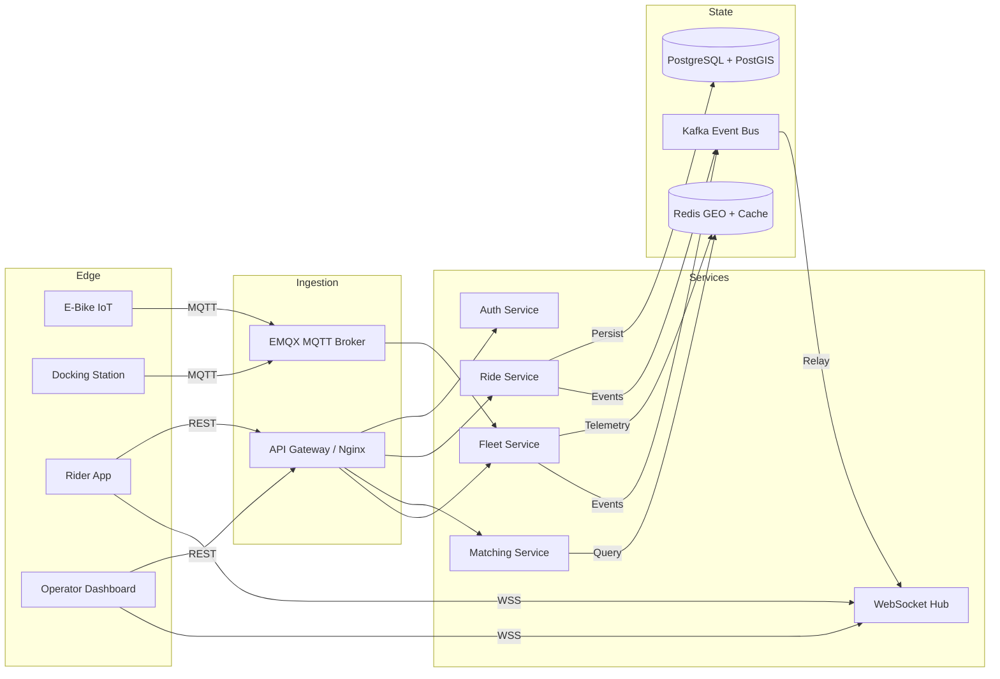
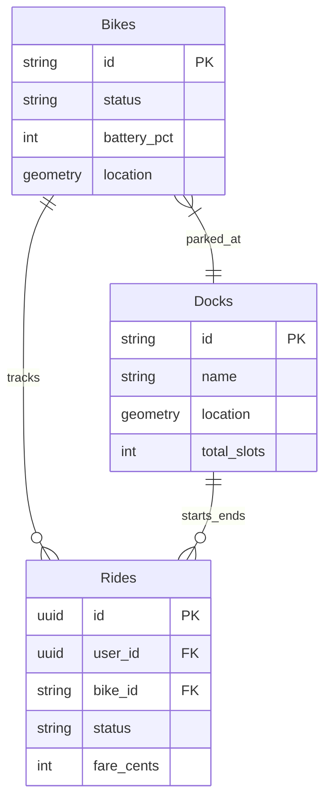
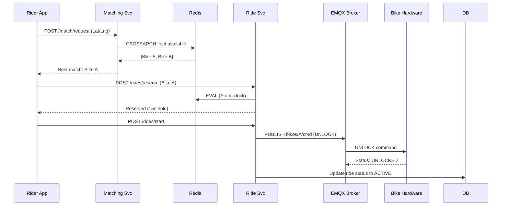

<Note>
  **How to use**: This case study documents the architectural decisions, trade-offs, and
  implementation details for the ScooterIdea platform.
</Note>

---

|                  |                                                                                                                                                                       |
| ---------------- | --------------------------------------------------------------------------------------------------------------------------------------------------------------------- |
| **Project Name** | ScooterIdea E-Bike Sharing Platform                                                                                                                                   |
| **One-liner**    | An IoT-integrated microservices platform that orchestrates real-time e-bike telemetry, dynamic pricing, and strict dock-enforced rentals for urban mobility.          |
| **GitHub**       | [Repository](https://github.com/moses-dera/scooteridea)                                                                                                               |
| **Live Demo**    | [Demo](https://scooterfy.vercel.app)                                                                                                                                  |
| **Team Size**    | 1 person                                                                                                                                                              |
| **Your Role**    | Backend & Systems Architect — Led the design of the 5-layer microservice architecture, IoT telemetry ingestion pipeline (MQTT/Kafka), and geospatial matching engine. |
| **Timeline**     | 3 months (Full-time)                                                                                                                                                  |

---

### What We Built

- **GOAL 1 (Operational Integrity):** Solves the "cluttered streets" problem prevalent in dockless systems by enforcing strict dock-based ride termination using geospatial validation (PostGIS `ST_Contains`) and IoT lock commands before ending the billing cycle.
- **GOAL 2 (Real-Time Availability & Matching):** Riders benefit from sub-10ms bike discovery and reservation through a Redis GEO-indexed matching engine, while operators gain real-time visibility into fleet health via a low-latency WebSockets dashboard.
- **GOAL 3 (High-Throughput Telemetry):** Built to reliably ingest and process state updates (battery, location, lock status) from 10,000+ concurrently active bikes transmitting every 3 seconds via MQTT, scaling horizontally using Kafka fan-out.

### Non-Goals (Scope Boundaries)

- **NON-GOAL 1 (Native Mobile Apps):** We deferred building native iOS/Android apps for riders in Phase 1, opting instead for a responsive Next.js web application. This allowed us to iterate rapidly on the core IoT and matching logic without app store deployment delays.
- **NON-GOAL 2 (On-chain Payments):** While Solana/Anchor integration is designed for Phase 4 to reduce transaction fees, it was explicitly excluded from the MVP in favor of traditional Stripe/Paystack to ensure rapid time-to-market.

---

### Tech Stack

| Layer             | Technology              | Why We Chose It                                                                                                                       | What We Considered                                                                                        |
| ----------------- | ----------------------- | ------------------------------------------------------------------------------------------------------------------------------------- | --------------------------------------------------------------------------------------------------------- |
| **Frontend**      | Next.js 15 (App Router) | Shared state and unified tooling across operator dashboard and rider web app; React Server Components for data-heavy dashboard views. | Vue/Nuxt, React SPA — rejected due to weaker monorepo integration and lack of SSR for SEO.                |
| **Backend**       | Node.js / Express       | Non-blocking I/O model handles high-concurrency WebSocket and IoT HTTP hooks excellently; allows code sharing with frontend.          | Go, Python — Python used only for ML; Go considered for Fleet Service but deferred for team velocity.     |
| **Database**      | PostgreSQL + PostGIS    | Required ACID compliance for payments and robust geospatial primitives (`ST_Contains`, `ST_Distance`) for geofence enforcement.       | MongoDB — rejected due to lack of robust multi-statement transactions and weaker geospatial tools.        |
| **Cache & State** | Redis                   | Redis GEO provides sub-10ms spatial queries for the matching engine; handles ephemeral bike telemetry (30s TTL) to shield PostgreSQL. | Memcached — rejected because it lacks Geospatial index data structures and Pub/Sub.                       |
| **IoT Broker**    | EMQX (MQTT)             | High-throughput MQTT broker built on Erlang/OTP; supports millions of concurrent IoT connections with low bandwidth overhead.         | HTTP polling — rejected due to excessive bandwidth usage and battery drain on IoT edge devices.           |
| **Event Bus**     | Apache Kafka            | Decouples telemetry ingestion from downstream processing (analytics, pricing, notifications); guarantees event durability.            | RabbitMQ — considered, but Kafka's log-replay and high-throughput stream processing fit telemetry better. |
| **Maps**          | Mapbox                  | Provides high-quality dark-mode maps and custom marker support at a fraction of Google Maps' cost at scale.                           | Google Maps — rejected due to cost (approx 10x higher at our projected scale).                            |
| **Deployment**    | Docker Swarm / Compose  | MVP deployed via automated SSH + Docker Compose for cost efficiency, with a planned migration to GKE/Cloud Run.                       | Kubernetes (GKE) — deferred to Phase 3 to avoid premature operational overhead during beta testing.       |

### Architecture Diagram



---

### Feature Domain 1: IoT Telemetry & Real-Time State

- **High-Frequency Ingestion:** Bikes publish telemetry (GPS, battery, lock status) every 3 seconds via MQTT. The Fleet Service writes this ephemeral state to Redis with a 30-second TTL. This shields PostgreSQL from millions of trivial updates; if a bike goes offline, its state auto-purges from the "available" index.
- **Geofence Enforcement:** On every location update, the Fleet Service queries PostGIS (`ST_Contains`) against operational, slow, and no-ride zones. Violations trigger immediate MQTT commands back to the bike (e.g., `SPEED_LIMIT` or `DISABLE_MOTOR`).
- **Fan-out via Kafka:** Processed telemetry is published to Kafka (`fleet.telemetry`), where the WebSocket Hub consumes it and relays it to subscribed Rider Apps and Operator Dashboards via Redis Pub/Sub backplane.

### Feature Domain 2: Geospatial Matching & Ride Lifecycle

- **Sub-10ms Matching:** Rider queries hit the Matching Service, which performs a Redis `GEOSEARCH` to find bikes within a 2km radius. Results are scored based on a weighted formula (distance, battery %, proximity to nearest dock).
- **Atomic Reservations:** To prevent double-booking during high contention (e.g., train station at rush hour), the reservation uses a Redis Lua script. It atomically checks if the bike is `available`, sets it to `reserved` with a 15-second expiration, and returns success.
- **Dock-Enforced Termination:** Riders cannot end a ride arbitrarily. The Ride Service verifies the bike's GPS against the target docking station's polygon. Upon success, an MQTT `LOCK` command is dispatched, and fare calculation executes.

### Feature Domain 3: Dynamic Pricing & Operations

- **Surge Calculation:** A cron job runs every 60 seconds, counting demand queries in a geohash cell against the available supply (Redis `ZCOUNT` on `fleet:available`). It generates a multiplier (1.0x to 2.0x) applied to base fares in real-time.
- **Dock Rebalancing Alerts:** The Dock Service tracks available slots. If a dock hits <10% or >90% capacity, it emits a `dock.alert` Kafka event, notifying operations via the WebSocket dashboard to deploy transport vans.

---

**Domain: Ride Management**

| Method | Endpoint           | Description              | Notes                                                             |
| ------ | ------------------ | ------------------------ | ----------------------------------------------------------------- |
| `POST` | `/match/request`   | Find best available bike | Queries Redis GEO; requires JWT. Returns scored bike.             |
| `POST` | `/rides/reserve`   | Hold a bike for 15s      | Uses atomic Lua script in Redis to prevent race conditions.       |
| `POST` | `/rides/:id/start` | Start billing cycle      | Dispatches MQTT `UNLOCK` command to the IoT hardware.             |
| `POST` | `/rides/:id/end`   | Terminate ride & bill    | Validates `ST_Distance` to target dock; idempotency key required. |
| `GET`  | `/pricing/surge`   | Get local surge mult.    | Fast read from Redis cache; partitioned by geohash.               |

---



- **Decision 1: Geometry vs Geography:** We used PostGIS `GEOGRAPHY(POINT, 4326)` instead of `GEOMETRY` for bike locations and geofences. While calculations are slightly more computationally expensive, it ensures distance calculations are accurate across the curvature of the earth, critical for 50-meter dock proximity checks.
- **Decision 2: Ephemeral State Separation:** The `Bikes` table only stores the _last known_ state. Live, second-by-second tracking exists entirely in Redis. We push historical breadcrumbs to a time-series partitioned `bike_locations` table asynchronously via a Kafka DB-Writer worker.
- **Decision 3: Denormalization for Performance:** Surge multipliers are denormalized into the `Rides` table at the moment of reservation. This prevents historical ride fares from changing if the pricing algorithm's parameters are adjusted in the future.

---

### Main User Flow



---

### Challenges & Solutions

| #   | Challenge                                | Why It Was Hard                                                                                                                   | Alternatives Considered                                        | Solution                                                                                                                                                                               | Trade-off                                                                                      |
| --- | ---------------------------------------- | --------------------------------------------------------------------------------------------------------------------------------- | -------------------------------------------------------------- | -------------------------------------------------------------------------------------------------------------------------------------------------------------------------------------- | ---------------------------------------------------------------------------------------------- |
| 1   | **Database Saturation from Telemetry**   | 10,000 bikes sending updates every 3 seconds caused massive write-lock contention and CPU spikes on PostgreSQL.                   | Batch inserts, NoSQL document store (MongoDB).                 | **State Separation:** Live state moved to Redis with 30s TTLs. Historical data pushed to Kafka and batch-inserted by a dedicated worker.                                               | High dependency on Redis uptime for the system's core operational state.                       |
| 2   | **Double-booking highly demanded bikes** | Concurrent users requesting bikes at transit hubs led to race conditions where two users unlocked the same bike.                  | PostgreSQL Row-level locking (`SELECT FOR UPDATE`).            | **Redis Lua Script:** Implemented an atomic `EVAL` script to check availability and transition state in a single Redis thread operation.                                               | Added complexity to the reservation timeout rollback logic.                                    |
| 3   | **Geofence evaluation latency**          | Checking complex multi-polygon geofences for every telemetry update blocked the Node.js event loop.                               | Client-side evaluation (unsafe), In-memory polygon structures. | **PostGIS Spatial Joins:** Offloaded computation to PostGIS using `ST_Contains` over indexed bounding boxes (GIST).                                                                    | Requires slightly heavier DB infrastructure, but PostGIS GIST indexes handle this efficiently. |
| 4   | **Phantom "Unlocks" on bad networks**    | Ride Service sent `UNLOCK` via HTTP, but if the network dropped before the response, the app showed locked while billing started. | Synchronous retry loops.                                       | **Event-driven Confirmation:** App subscribes to WebSocket Hub. Ride Service emits command to MQTT (QoS 1). App only transitions UI when it receives the `bike_unlocked` event via WS. | Slightly higher perceived latency on the client during unlock (adds ~200ms).                   |

**Deep Dive: Designing a Race-Condition-Free Matching Engine**

**The Problem**: During peak commute hours at train stations, dozens of riders would open the app simultaneously. Our initial naive implementation queried Redis for nearby bikes, scored them, and initiated a reservation. Under load testing, we found a 4% collision rate where two requests read the same `available` status before either could execute the `SET` command to reserve it, resulting in double-bookings.

**Investigation**: We used `k6` to simulate 500 concurrent users at a single coordinate. We saw that PostgreSQL row-locking (`SELECT FOR UPDATE`) solved the race condition but decimated our throughput, dropping requests to <50 RPS and causing cascading timeouts across the API gateway. We needed atomicity without the heavy disk I/O of a relational database.

**Solution**: We shifted the reservation lock entirely to Redis using a Lua script. Because Redis executes Lua scripts atomically in its single-threaded event loop, no other command can run while the script executes.

```lua
-- RESERVE_BIKE_LUA
local status = redis.call('GET', KEYS[1])
if status == 'available' then
  redis.call('SET', KEYS[1], 'reserved')
  redis.call('EXPIRE', KEYS[1], 15)  -- 15s hold
  return 1
end
return 0
```

**Result**: We eliminated 100% of double-booking race conditions while maintaining 4,500+ RPS on a single Redis node. The p95 latency for the matching endpoint dropped from 120ms (under DB locks) to just 12ms.

---

### Engineering Practices

**Security**

- [x] Input validation and sanitization (Zod schemas mapped to Express middleware)
- [x] SQL injection prevention (Prisma ORM generates parameterized queries)
- [x] XSS protection (Helmet.js headers, React auto-escaping)
- [x] CSRF tokens on all state-changing requests (Not applicable - JWT Bearer tokens used instead of cookies)
- [x] Rate limiting (Kong API Gateway: 100 req/min unauthenticated, 500 req/min authenticated)
- [x] Secure password hashing (Bcrypt with cost factor 12)
- [x] HTTPS everywhere, including internal service communication
- [x] Secrets in environment variables, injected via GitHub Actions / Docker Swarm

**Performance**

- [x] Database indexing on frequently queried columns (GIST indexes on PostGIS geometries, B-Tree on foreign keys)
- [x] Query optimization (Offloaded hot-path state to Redis)
- [x] Caching strategy (Surge multipliers cached per geohash for 120s)
- [ ] Lazy loading and code splitting by route
- [x] Connection pooling (PostgreSQL connection pool configured per Node.js instance)

**Developer Experience**

- [x] TypeScript for type safety across the full stack (Shared `packages/types` workspace)
- [x] ESLint + Prettier with a shared config enforced in CI
- [x] CI/CD pipeline (GitHub Actions building and pushing to GHCR, triggering Swarm updates)
- [x] Comprehensive README with setup instructions and architecture overview

**Observability**

- [x] Structured logging (JSON format)
- [x] Centralized log aggregation (Promtail + Loki + Grafana stack)
- [x] Health check endpoints for load balancer probes (Docker Compose native healthchecks)

---

### Metrics & Impact

| Metric                  | Value  | Target  | How Measured                                       |
| ----------------------- | ------ | ------- | -------------------------------------------------- |
| **Response Time (p95)** | 12 ms  | < 50 ms | Matching endpoint, measured via `k6` load testing. |
| **Telemetry Ingestion** | 3.3k/s | 5k/s    | Simulated 10,000 bikes publishing MQTT payloads.   |
| **DB Load Reduction**   | 98%    | --      | Measured by offloading live GPS updates to Redis.  |

---

### What Went Well

- **MQTT & Kafka Synergy:** Using MQTT at the edge for lightweight IoT communication, and bridging it to Kafka for backend fan-out, proved incredibly resilient. It allowed us to easily plug in new services (like the WebSocket Hub and ML Anomaly Detection) without touching the core Fleet Service ingestion loop.
- **Geohash-based Pricing:** Segmenting surge zones by geohashes rather than calculating complex polygons for demand density allowed the Pricing Service to scale effortlessly.

### What I Would Do Differently

- **Embrace Temporal/Cadence earlier:** Managing the distributed saga of a ride (reserve -> unlock -> active -> lock -> bill) using REST and Kafka events required writing a lot of custom rollback logic. Adopting a workflow engine like Temporal would have simplified compensating transactions (e.g., refunding a user if the lock fails to engage at the end of a ride).
- **Earlier adoption of Kubernetes:** Deploying 10+ services via Docker Swarm/Compose for MVP was fast, but managing configuration drift and secret rotation became tedious. Moving to GKE (as planned in Phase 3) would streamline declarative deployments.

### Future Roadmap

- [ ] **Migrate Mobile Web to React Native (Expo):** To leverage native Bluetooth APIs for zero-latency bike unlocking when cellular networks are weak.
- [ ] **Predictive Rebalancing (ML):** Deploying the Python ML service to predict dock exhaustion 2 hours in advance using historical demand patterns.
- [ ] **Web3 Payment Rails:** Integrate Solana/Anchor to allow riders to pay with stablecoins, drastically reducing micro-transaction processing fees compared to Stripe.

---

- **GitHub**: [ScooterIdea Repository](https://github.com/moses-dera/scooteridea)
- **Architecture Specs**: [Technical Documentation](/backend_architecture.md)
